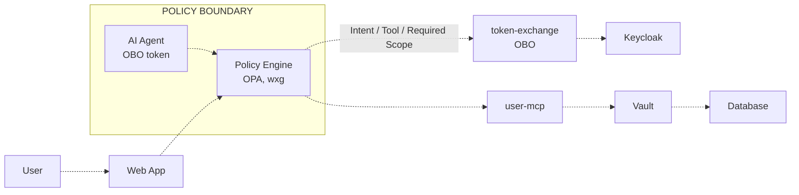

# Agentic IAM Runtime Security Demo

This repository contains a demo environment that combines Keycloak, HashiCorp Vault, HashiCorp Consul, an AI agent runtime, identity token exchange, and policy / governance enforcement. It demonstrates how a user can authenticate with Keycloak, how agentic workloads can receive a unique non-human identity at runtime through platform-native identity using a Vault-issued OIDC token, and how runtime security controls can be enforced transparently through Consul with pluggable policy engines.

## High-level architecture

The core demo flow is:

At a platform level:

1. Keycloak authenticates the user and issues the user token for the request context.
2. The runtime platform provides the workload's native identity to the agentic workload.
3. HashiCorp Vault converts that platform-native identity into an OIDC-conformant identity token for the workload, giving the agent a unique non-human identity without application code changes.
4. The token-exchange service uses the user token and the Vault-issued workload identity token to obtain delegated credentials for downstream access.
5. HashiCorp Consul provides the service mesh and transparent runtime enforcement layer for agent-facing traffic. In the local minikube flow, Vault is the mesh's certificate authority (Consul's Connect CA), and Vault and Postgres are themselves mesh services. The Envoy sidecar delegates request/response inspection to `opa-gov-api` (OPA) or `wx-gov-api` (watsonx.governance) via a thin Lua filter.
6. HashiCorp Vault also acts as the secure policy distribution layer for OPA-backed controls, while pluggable policy engines such as OPA and watsonx.governance evaluate requests and responses without requiring changes to the agent application code. Policies themselves are authored and tested in `opa-policy-studio`.

### Runtime controls enforced by the platform

Consul, Vault, and the pluggable policy engines enforce runtime controls around the agent without changing application code. In practice, that means the platform can:

- block prompt injection and malicious instruction override attempts before the agent acts on them
- stop unsafe tool usage or unauthorized code-execution patterns before they reach downstream systems
- detect and mask PII or other sensitive data in prompts and responses
- prevent sensitive data leakage, prompt leakage, and other policy-violating outputs before they leave the runtime

### Architecture diagrams

#### Agentic identity

#### Agentic runtime security

The main repo components are:

| Component | Purpose |
| --- | --- |
| [`web-app/`](./web-app/) | Next.js 15 (App Router) + React 19 + TypeScript UI styled with the IBM Carbon Design System; handles Keycloak OAuth login, streaming AI chat, and the subject / actor / OBO token inspector |
| [`web-app-deprecated/`](./web-app-deprecated/) | Archived Streamlit version of the web app, kept for reference only |
| [`ai-agent/`](./ai-agent/) | FastAPI-based AI agent runtime that uses delegated identity and executes agent tools |
| [`litellm-gateway/`](./litellm-gateway/) | LiteLLM AI gateway config (PEP/PDP) between `web-app`, `ai-agent`, the LLM and `user-mcp`: a `custom_auth` hook that admits `ai-agent` and `web` by their Consul mesh (SPIFFE) identity instead of a shared key, an OPA content guardrail, and an MCP gateway to `user-mcp` |
| [`user-mcp/`](./user-mcp/) | FastMCP server exposing user-management tools over streamable HTTP; validates the OBO/CIBA JWT against Keycloak JWKS, enforces a per-tool `users.read` / `users.write` scope contract, gates writes on a Vault-policy-driven CIBA approval, and mints per-request Vault-issued Postgres credentials via Vault's OAuth Resource Server |
| [`token-exchange/`](./token-exchange/) | FastAPI identity broker that performs Keycloak on-behalf-of (RFC 8693) token exchange |
| [`keycloak-providers/`](./keycloak-providers/) | Custom Keycloak protocol-mapper SPI (RAR + actor-claim injection) baked into the Keycloak image — see [KEYCLOAK_REALM_SETUP.md](./KEYCLOAK_REALM_SETUP.md) |
| [`ciba-channel/`](./ciba-channel/) | Minimal HTTP approval webhook backing Keycloak's CIBA authentication channel |
| [`opa-gov-api/`](./opa-gov-api/) | FastAPI wrapper in front of OPA exposing `POST /evaluate` (prompt-injection + unsafe-code check) and `POST /mask` (PII masking), so the Envoy Lua filter can stay thin |
| [`opa-policy-studio/`](./opa-policy-studio/) | React + TypeScript + Vite frontend-only PoC for authoring, listing, and evaluating OPA policies from the browser (Monaco editor, Rego highlighting, built-in Prompt Injection / Code Safety / PII test presets) |
| [`opa-mcp-auth/`](./opa-mcp-auth/) | Data-driven MCP tool authorization: Rego policy + Vault KV v2 catalog of `(source-agent → destination-MCP → allowed tools)` pairs, hot-reloaded into OPA by a vault-agent sidecar with no pod restart on rule changes |
| [`consul-mcp-authz/`](./consul-mcp-authz/) | Operator-facing layer for the `opa-mcp-auth` catalog: FastAPI REST service (CRUD + history/rollback + live MCP `tools/list` discovery) and a Next.js operator console (Rules list, View/Edit, New Rule, History) packaged in one image |
| [`wx-gov-api/`](./wx-gov-api/) | watsonx.governance policy engine integration for runtime guardrails |
| [`infra/`](./infra/) | Terraform and AMI build workflow for provisioning the demo platform, including Vault and Consul foundations |
| [`deploy-k8s/`](./deploy-k8s/) | Kubernetes, Consul, and policy-enforcement deployment manifests plus deployment order |
| [`documentation/agent_control_plane/`](./documentation/agent_control_plane/) | Product-level architecture diagrams for the agentic security control plane |
| [`documentation/agentic_identity/`](./documentation/agentic_identity/) | Design documentation for platform-native identity to Vault-issued agent identity |
| [`documentation/agentic_runtime_security/`](./documentation/agentic_runtime_security/) | Design documentation for runtime security enforcement with Consul, Vault, and pluggable policy engines |
| [`deploy-k8s/opa-server.yaml`](./deploy-k8s/opa-server.yaml) | Deploys the OPA server used for runtime policy evaluation, with Vault Agent injecting policies securely from HashiCorp Vault into the OPA runtime |
| HashiCorp Vault + platform identity | Issues OIDC-conformant workload identity tokens for agentic workloads from platform-native identity and securely distributes OPA policy content |
| HashiCorp Consul + Envoy | Enforces transparent runtime controls and policy checks around service-to-service traffic |

## Use cases covered

- Unique non-human identity for agentic workloads using platform-native identity and a HashiCorp Vault OIDC identity token, automatically injected by the platform into agentic workloads without requiring code changes
- Agentic runtime security with HashiCorp Consul, HashiCorp Vault, and pluggable policy engines (OPA and watsonx.governance) without requiring code changes, including prompt injection prevention, PII masking, sensitive data filtering, and unsafe action blocking
- Keycloak-authenticated user access combined with delegated on-behalf-of token exchange for downstream agent actions
- Human-in-the-loop approval for sensitive agent actions via Keycloak CIBA (Client-Initiated Backchannel Authentication): writes gated by a Vault ACL policy switch block until the caller approves on a separate device
- Deployment of the demo services into Kubernetes with Consul service mesh configuration and observability services

## Provision the demo environment

Run the infrastructure workflow from [`infra/`](./infra/).

1. Review prerequisites and build the base AMI by following [`infra/README.md`](./infra/README.md) and the detailed AMI instructions in [`infra/ami/base_image/README.md`](./infra/ami/base_image/README.md).
2. From `infra/`, initialize and validate Terraform, then apply the modules in the documented order:
   - `module.common`
   - `module.servers`
   - `module.consul_client_k8s`
   - `module.observability`
3. Do not provision the modules called out as excluded in [`infra/README.md`](./infra/README.md).

For the exact commands, prerequisites, generated artifacts, and apply sequence, use [`infra/README.md`](./infra/README.md).

## Deploy the sample applications

After Terraform provisioning is complete, deploy the workloads by following [`deploy-k8s/README.md`](./deploy-k8s/README.md).

The documented deployment flow covers:

1. Consul base configuration
2. `token-exchange`
3. `user-mcp`
4. `ai-agent`
5. `web-app` (Next.js + Carbon)
6. OPA deployment (plus `opa-gov-api` as the Envoy-facing HTTP front end)
7. `wx-gov-api` deployment
8. `opa-mcp-authz` pilot — data-driven MCP tool authorization (policy ConfigMap, OPA Deployment with vault-agent sidecar, `user-mcp` ext_authz wiring)
9. `consul-mcp-authz` — catalog API + operator UI for managing the MCP authorization catalog
10. Service intentions

Use the component READMEs below for service-specific configuration, local development, container builds, and runtime details.

## Detailed component documentation

| Document | Covers |
| --- | --- |
| [`documentation/Guia_Configuracao.md`](./documentation/Guia_Configuracao.md) | Guia de configuração do laboratório (minikube): env vars, Keycloak, Vault CIBA/LoA, Consul (incl. Vault como CA da malha, Vault e Postgres na malha), LiteLLM, timeouts |
| [`infra/local-minikube/README.md`](./infra/local-minikube/README.md) | Local minikube stages (`bootstrap` / `configure` / `keycloak` / `images` / `deploy`), the mesh setup for Vault and Postgres, and Vault as the Consul Connect CA |
| [`infra/README.md`](./infra/README.md) | Terraform provisioning sequence for the demo environment |
| [`infra/ami/base_image/README.md`](./infra/ami/base_image/README.md) | Base AMI build process required before Terraform apply |
| [`deploy-k8s/README.md`](./deploy-k8s/README.md) | Kubernetes deployment order, secrets, Consul config, and cleanup |
| [`web-app/README.md`](./web-app/README.md) | Next.js + Carbon web UI setup, Keycloak OAuth configuration, scripts, Docker, and Kubernetes details |
| [`ai-agent/README.md`](./ai-agent/README.md) | AI agent API behavior, configuration, local run, container build, and Kubernetes details |
| [`user-mcp/README.md`](./user-mcp/README.md) | FastMCP server setup, tool → scope contract, JWT validation, file vs. Postgres backends, Vault JWT auth + dynamic Postgres credential issuance per request, and deployment details |
| [`token-exchange/README.md`](./token-exchange/README.md) | Identity broker configuration, OBO token exchange service behavior, and deployment details |
| [`opa-gov-api/README.md`](./opa-gov-api/README.md) | OPA Governance API (`/evaluate`, `/mask`) wrapper setup, env vars, and Envoy integration contract |
| [`opa-policy-studio/README.md`](./opa-policy-studio/README.md) | OPA Policy Studio PoC — run the browser-based policy authoring / evaluation UI against an OPA server |
| [`opa-mcp-auth/README.md`](./opa-mcp-auth/README.md) | Data-driven MCP tool authorization pilot — Rego policy, Vault KV v2 catalog seeding, OPA `--watch` hot-reload, and end-to-end live-reload tests against `user-mcp` |
| [`consul-mcp-authz/README.md`](./consul-mcp-authz/README.md) | MCP authorization catalog API + operator UI — REST endpoints, single-image build (API + Next.js under supervisord), live MCP `tools/list` discovery, and UI walkthrough |
| [`documentation/agentic_identity/platform_to_agentic_identity.md`](./documentation/agentic_identity/platform_to_agentic_identity.md) | Platform-native identity to Vault-issued agent identity design pattern |
| [`documentation/agentic_runtime_security/ai_guardrails.md`](./documentation/agentic_runtime_security/ai_guardrails.md) | Runtime security architecture with Consul, Vault, OPA, and watsonx.governance |
| [`wx-gov-api/README.md`](./wx-gov-api/README.md) | watsonx.governance policy engine service setup and API usage |

## Suggested read order

1. Start with this README for the overall demo flow.
2. Use [`documentation/Guia_Configuracao.md`](./documentation/Guia_Configuracao.md) for env vars, IdP, Vault CIBA, mesh, and LLM.
3. Use [`infra/local-minikube/README.md`](./infra/local-minikube/README.md) (or [`infra/README.md`](./infra/README.md) on AWS) to provision the environment.
4. Use [`deploy-k8s/README.md`](./deploy-k8s/README.md) to deploy the workloads.
5. Use the individual service READMEs for detailed configuration and troubleshooting.
