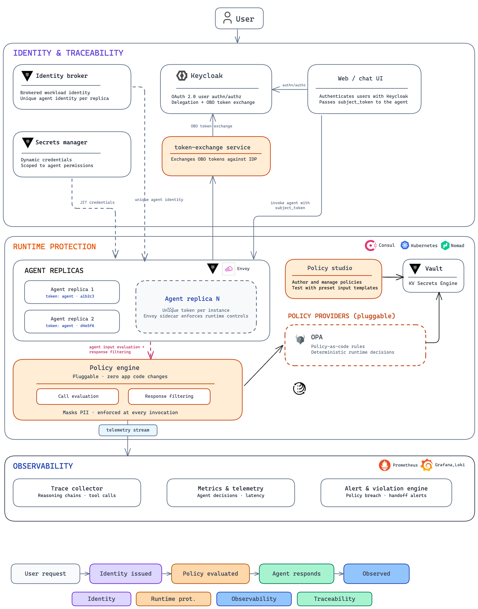
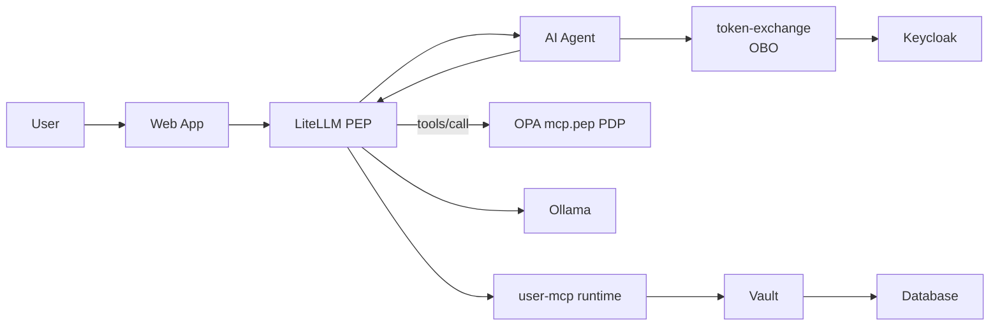
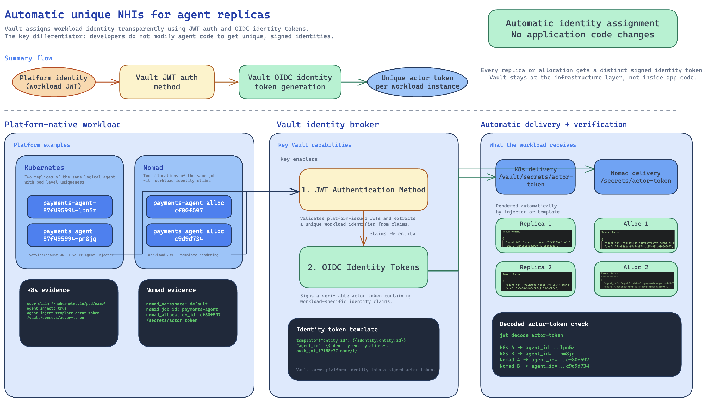

# Agentic IAM Runtime Security Demo

This repository contains a demo environment that combines Keycloak, HashiCorp Vault, HashiCorp Consul, an AI agent runtime, identity token exchange, and policy / governance enforcement. It demonstrates how a user can authenticate with Keycloak, how agentic workloads can receive a unique non-human identity at runtime through platform-native identity using a Vault-issued OIDC token, and how runtime security controls can be enforced transparently through Consul with pluggable policy engines.

## High-level architecture

The core demo flow (laboratório minikube — LiteLLM é o PEP de IA):

Arquitetura, pastas, tools e scripts: [`documentation/arquitetura-detalhada.md`](./documentation/arquitetura-detalhada.md). Fluxo e papéis: [`documentation/fluxo-e-responsabilidades.md`](./documentation/fluxo-e-responsabilidades.md).

At a platform level:

1. Keycloak authenticates the user and issues the user token for the request context.
2. The runtime platform provides the workload's native identity to the agentic workload.
3. HashiCorp Vault converts that platform-native identity into an OIDC-conformant identity token for the workload, giving the agent a unique non-human identity without application code changes.
4. The token-exchange service uses the user token and the Vault-issued workload identity token to obtain delegated credentials for downstream access.
5. HashiCorp Consul is the API Gateway (norte-sul) and the mTLS/SPIFFE mesh (leste-oeste). In the local minikube flow, Vault is the mesh's certificate authority (Connect CA), and Vault and Postgres are themselves mesh services.
6. **LiteLLM** is the PEP + AI Gateway (SPIFFE admission, MCP `tools/call`, optional content guardrail). **OPA `opa-server` (`mcp.pep`)** is the PDP for catalog and scope. Vault stores the OPA bundle and MCP catalog and issues secrets (`database/creds`, Transform, actor token). The Lua filter on `ai-agent` is **not** applied by `make deploy`.

### Runtime controls enforced by the platform

Consul (rede), LiteLLM+OPA (IA), and Vault (segredos) enforce runtime controls without changing the agent application code. In the lab that means:

- admit only mesh identities (`default/web`, `default/ai-agent`) at the AI gateway
- allow or deny MCP tools from the Vault KV catalog and `users.read` / `users.write` scopes
- require a Keycloak MFA step-up (LoA) for `create_user`, validated by Vault on the write path
- mint per-request Postgres credentials and mask PII on reads (Transform) unless the caller is `admin`
- optionally block prompt injection via the LiteLLM content guardrail → `opa-gov-api`

### Architecture diagrams

#### Agentic identity

#### Agentic runtime security

The main repo components are:

| Component | Purpose |
| --- | --- |
| [`web-app/`](./web-app/) | Next.js 15 (App Router) + React 19 + TypeScript UI styled with the IBM Carbon Design System; handles Keycloak OAuth login, streaming AI chat, and the subject / actor / OBO token inspector |
| [`ai-agent/`](./ai-agent/) | FastAPI-based AI agent runtime that uses delegated identity and executes agent tools |
| [`litellm-gateway/`](./litellm-gateway/) | PEP + AI Gateway (ConfigMap): SPIFFE `custom_auth`, CustomGuardrail `pdp_mcp.py` (OPA `mcp.pep`), content guardrail, MCP nativo para `user-mcp` |
| [`user-mcp/`](./user-mcp/) | FastMCP runtime (`USER_MCP_PEP_MODE=runtime`): tools de usuários, SQL, `database/creds` e Transform. JWT/scope ficam no LiteLLM |
| [`token-exchange/`](./token-exchange/) | FastAPI identity broker that performs Keycloak on-behalf-of (RFC 8693) token exchange |
| [`keycloak-providers/`](./keycloak-providers/) | Custom Keycloak protocol-mapper SPI (RAR + actor-claim injection) baked into the Keycloak image — see [KEYCLOAK_REALM_SETUP.md](./KEYCLOAK_REALM_SETUP.md) |
| [`opa-gov-api/`](./opa-gov-api/) | FastAPI wrapper in front of OPA: `POST /evaluate` (prompt-injection + unsafe-code) and `POST /mask` (PII). LiteLLM guardrail chama `/evaluate` |
| [`opa-policy-studio/`](./opa-policy-studio/) | React + TypeScript + Vite frontend-only PoC for authoring, listing, and evaluating OPA policies from the browser (Monaco editor, Rego highlighting, built-in Prompt Injection / Code Safety / PII test presets) |
| [`opa-mcp-auth/`](./opa-mcp-auth/) | Seed + Rego legado `ext_authz`. O catálogo KV ainda é a fonte; no lab quem consulta é o **opa-server** (`mcp.pep`), não o sidecar do MCP |
| [`consul-mcp-authz/`](./consul-mcp-authz/) | UI/API operador do catálogo Vault `opa-policies/mcp-authz/catalog` |
| [`vault-log/`](./vault-log/) | Viewer SSE dos hops (`make hop-logs` → http://127.0.0.1:8753/) |
| [`infra/`](./infra/) | Terraform and AMI build workflow for provisioning the demo platform, including Vault and Consul foundations |
| [`deploy-k8s/`](./deploy-k8s/) | Kubernetes, Consul, and policy-enforcement deployment manifests plus deployment order |
| [`documentation/agent_control_plane/`](./documentation/agent_control_plane/) | Product-level architecture diagrams for the agentic security control plane |
| [`documentation/agentic_identity/`](./documentation/agentic_identity/) | Design documentation for platform-native identity to Vault-issued agent identity |
| [`documentation/agentic_runtime_security/`](./documentation/agentic_runtime_security/) | Design documentation for runtime security enforcement with Consul, Vault, and pluggable policy engines |
| [`deploy-k8s/opa-server.yaml`](./deploy-k8s/opa-server.yaml) | Deploys the OPA server used for runtime policy evaluation, with Vault Agent injecting policies securely from HashiCorp Vault into the OPA runtime |
| HashiCorp Vault + platform identity | Issues OIDC-conformant workload identity tokens for agentic workloads from platform-native identity and securely distributes OPA policy content |
| HashiCorp Consul + Envoy | Enforces transparent runtime controls and policy checks around service-to-service traffic |

## Use cases covered

- Unique non-human identity for agentic workloads using platform-native identity and a HashiCorp Vault OIDC identity token, automatically injected by the platform into agentic workloads without requiring code changes
- Agentic runtime security with HashiCorp Consul, HashiCorp Vault, and pluggable policy engines (OPA) without requiring code changes, including prompt injection prevention, PII masking, sensitive data filtering, and unsafe action blocking
- Keycloak-authenticated user access combined with delegated on-behalf-of token exchange for downstream agent actions
- MFA step-up (LoA) enforced for `create_user`, validated independently by Vault on the write path
- Deployment of the demo services into Kubernetes with Consul service mesh configuration and observability services

## Provision the demo environment

Run the infrastructure workflow from [`infra/`](./infra/).

1. Review prerequisites and build the base AMI by following [`infra/README.md`](./infra/README.md) and the detailed AMI instructions in [`infra/ami/base_image/README.md`](./infra/ami/base_image/README.md).
2. From `infra/`, initialize and validate Terraform, then apply the modules in the documented order:
   - `module.common`
   - `module.servers`
   - `module.consul_client_k8s`
   - `module.observability`
3. Do not provision the modules called out as excluded in [`infra/README.md`](./infra/README.md).

For the exact commands, prerequisites, generated artifacts, and apply sequence, use [`infra/README.md`](./infra/README.md).

## Deploy the sample applications

After Terraform provisioning is complete, deploy the workloads by following [`deploy-k8s/README.md`](./deploy-k8s/README.md).

The documented deployment flow covers:

1. Consul base configuration
2. `token-exchange`
3. `user-mcp` (runtime; sem ext_authz)
4. LiteLLM PEP + `opa-server` (`mcp.pep`) + `opa-gov-api`
5. `ai-agent` (MCP e LLM via LiteLLM)
6. `web-app` (Next.js + Carbon)
7. `opa-mcp-authz` + `consul-mcp-authz` (catálogo KV; enforce é o LiteLLM)
8. Service intentions

Para o lab local: [`infra/local-minikube/README.md`](./infra/local-minikube/README.md) (`make up`).

Use the component READMEs below for service-specific configuration, local development, container builds, and runtime details.

## Detailed component documentation

| Document | Covers |
| --- | --- |
| [`documentation/arquitetura-detalhada.md`](./documentation/arquitetura-detalhada.md) | Mapa de pastas, papéis, tools MCP, scripts do `make up` |
| [`documentation/fluxo-e-responsabilidades.md`](./documentation/fluxo-e-responsabilidades.md) | Hop a hop e tabela PEP vs PDP |
| [`documentation/pep-inventory.md`](./documentation/pep-inventory.md) | Inventário de regras (lab + legado) |
| [`documentation/Guia_Configuracao.md`](./documentation/Guia_Configuracao.md) | Guia de configuração do laboratório (minikube): env vars, Keycloak, Vault, Consul, LiteLLM, Ollama, timeouts |
| [`infra/local-minikube/README.md`](./infra/local-minikube/README.md) | Local minikube stages (`bootstrap` / `configure` / `keycloak` / `images` / `deploy`), the mesh setup for Vault and Postgres, and Vault as the Consul Connect CA |
| [`litellm-gateway/README.md`](./litellm-gateway/README.md) | PEP CustomGuardrail + `custom_auth` SPIFFE |
| [`vault-log/README.md`](./vault-log/README.md) | Hop viewer SSE (`make hop-logs`) |
| [`infra/README.md`](./infra/README.md) | Terraform provisioning sequence for the demo environment |
| [`infra/ami/base_image/README.md`](./infra/ami/base_image/README.md) | Base AMI build process required before Terraform apply |
| [`deploy-k8s/README.md`](./deploy-k8s/README.md) | Kubernetes deployment order, secrets, Consul config, and cleanup |
| [`web-app/README.md`](./web-app/README.md) | Next.js + Carbon web UI setup, Keycloak OAuth configuration, scripts, Docker, and Kubernetes details |
| [`ai-agent/README.md`](./ai-agent/README.md) | AI agent API behavior, configuration, local run, container build, and Kubernetes details |
| [`user-mcp/README.md`](./user-mcp/README.md) | FastMCP server setup, tool → scope contract, JWT validation, file vs. Postgres backends, Vault JWT auth + dynamic Postgres credential issuance per request, and deployment details |
| [`token-exchange/README.md`](./token-exchange/README.md) | Identity broker configuration, OBO token exchange service behavior, and deployment details |
| [`opa-gov-api/README.md`](./opa-gov-api/README.md) | OPA Governance API (`/evaluate`, `/mask`) wrapper setup, env vars, and Envoy integration contract |
| [`opa-policy-studio/README.md`](./opa-policy-studio/README.md) | OPA Policy Studio PoC — run the browser-based policy authoring / evaluation UI against an OPA server |
| [`opa-mcp-auth/README.md`](./opa-mcp-auth/README.md) | Data-driven MCP tool authorization pilot — Rego policy, Vault KV v2 catalog seeding, OPA `--watch` hot-reload, and end-to-end live-reload tests against `user-mcp` |
| [`consul-mcp-authz/README.md`](./consul-mcp-authz/README.md) | MCP authorization catalog API + operator UI — REST endpoints, single-image build (API + Next.js under supervisord), live MCP `tools/list` discovery, and UI walkthrough |
| [`documentation/agentic_identity/platform_to_agentic_identity.md`](./documentation/agentic_identity/platform_to_agentic_identity.md) | Platform-native identity to Vault-issued agent identity design pattern |
| [`documentation/agentic_runtime_security/ai_guardrails.md`](./documentation/agentic_runtime_security/ai_guardrails.md) | Runtime security architecture with Consul, Vault, and OPA |

## Suggested read order

1. Start with [`documentation/arquitetura-detalhada.md`](./documentation/arquitetura-detalhada.md) for who does what and where the code lives.
2. Use [`documentation/Guia_Configuracao.md`](./documentation/Guia_Configuracao.md) for env vars, IdP, Vault, mesh, and LLM.
3. Use [`infra/local-minikube/README.md`](./infra/local-minikube/README.md) (or [`infra/README.md`](./infra/README.md) on AWS) to provision the environment.
4. Use [`deploy-k8s/README.md`](./deploy-k8s/README.md) to deploy the workloads.
5. Use the individual service READMEs for detailed configuration and troubleshooting.
