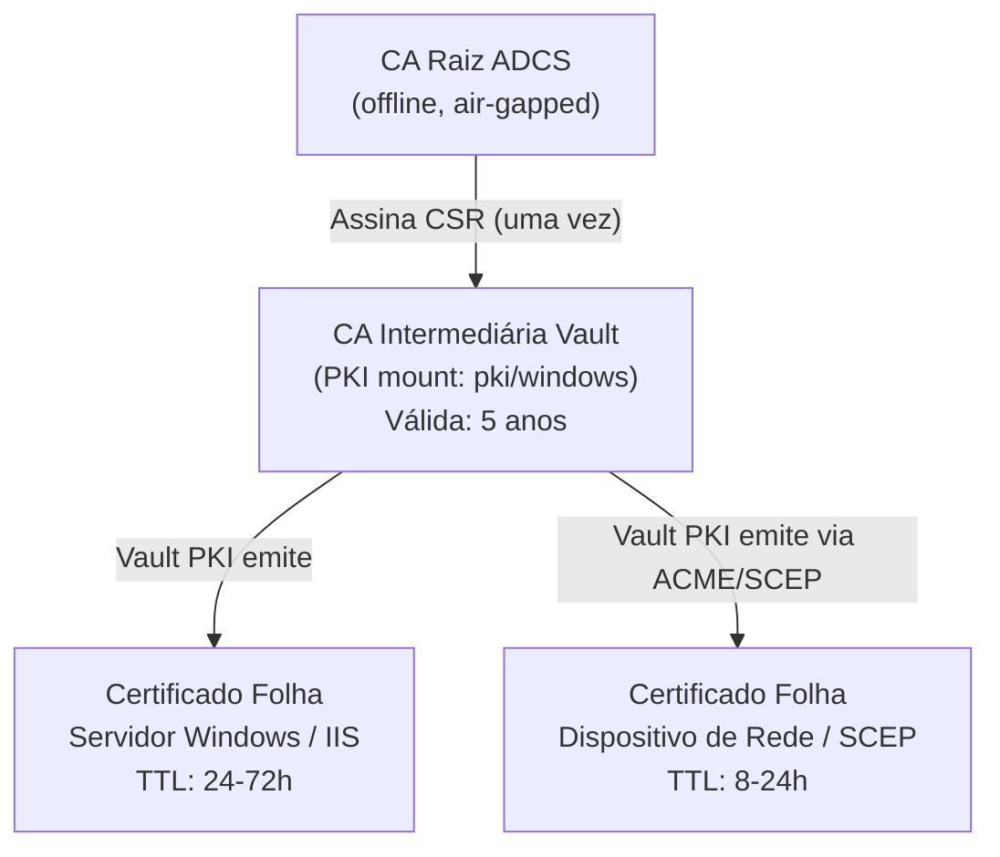
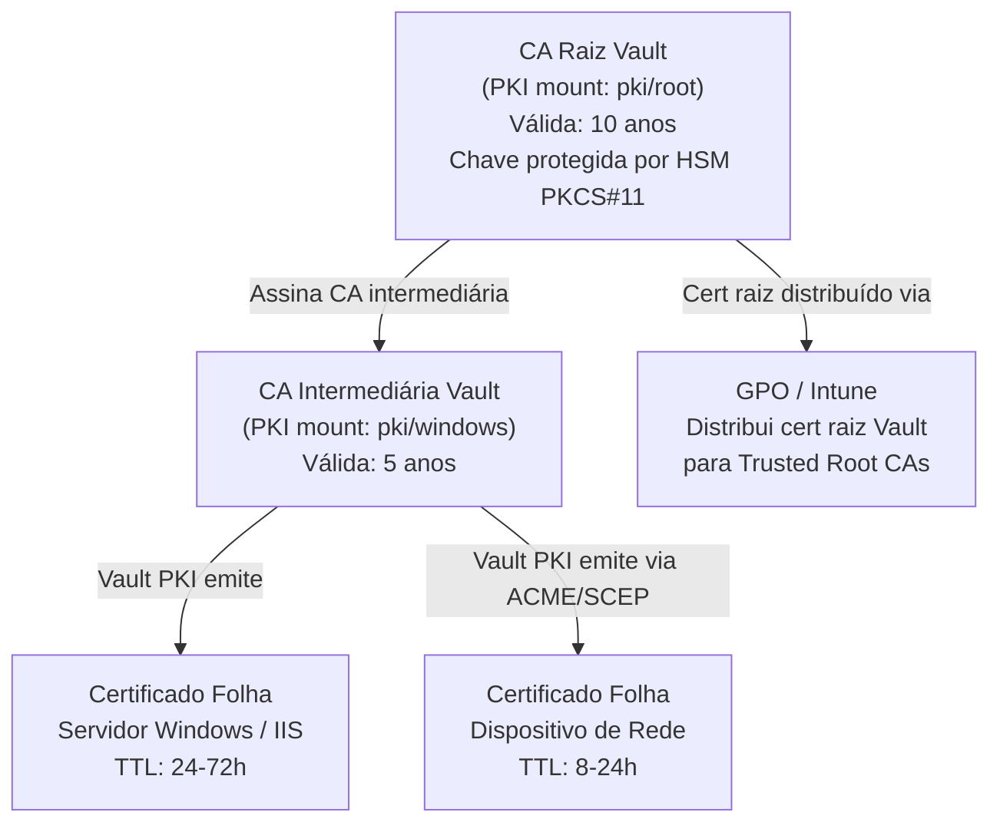

# Substituindo o Registro Automático ADCS e o NDES com HashiCorp Vault Enterprise PKI

---

## Introdução

O **Registro Automático ADCS** (*Auto-Enrolment*) e o **NDES/SCEP** (*Network Device Enrolment Service*) são as duas formas dominantes pelas quais ambientes Windows obtêm certificados de máquina e aplicação hoje. O Registro Automático permite que workstations e servidores ingressados no domínio solicitem e renovem certificados automaticamente por meio de Política de Grupo (GPO), templates de certificado publicados no Active Directory e o protocolo MS-WCCE. Já o NDES implementa o protocolo SCEP (*Simple Certificate Enrolment Protocol*) para dispositivos que não pertencem ao domínio — roteadores, balanceadores de carga, servidores IIS em workgroups e dispositivos de rede em geral.

Ambos os mecanismos dependem fortemente da infraestrutura do Active Directory (LDAP, Kerberos, grupos de segurança) e do serviço Windows CA (`certsvc`). Isso cria acoplamento entre a emissão de certificados e a disponibilidade do AD, dificulta auditorias centralizadas, impede ciclos de vida curtos de certificados (*short-lived certs*) e limita a capacidade de aplicar políticas granulares baseadas em identidade de carga de trabalho.

O **HashiCorp Vault Enterprise PKI** pode substituir integralmente o papel de emissão de certificados folha (*leaf certificates*), fornecendo:

- **Certificados de TTL curto** — de horas a dias, reduzindo drasticamente a janela de exposição de uma chave comprometida.
- **Logs de auditoria imutáveis** — cada emissão, revogação e renovação é registrada no device de auditoria do Vault, pronto para ingestão em SIEM.
- **Segredos dinâmicos** — o certificado e a chave privada existem apenas na memória do agente e no disco efêmero; nunca são armazenados de forma permanente no Vault.
- **Políticas granulares (HCL)** — controle fino sobre quais identidades (AppRole, Kubernetes, AWS IAM) podem emitir certificados para quais domínios e EKUs.
- **Sem dependência do AD** — o Vault pode usar qualquer método de autenticação; a identidade de máquina pode ser provada via AppRole, certificado TLS mútuo ou integração cloud.
- **Suporte a ACME (RFC 8555) e SCEP** — clientes nativos como `win-acme` e dispositivos de rede legados podem usar protocolos padrões de mercado.

Este documento descreve, passo a passo, como migrar ambientes Windows do ADCS e NDES para o Vault Enterprise PKI, cobrindo design de cadeia de confiança, configuração de Vault Agent, módulo Terraform completo, estratégia de rollout via GPO e considerações de segurança.

---

## Seção 1 — Design da Cadeia de Confiança

Existem dois modelos válidos para integrar o Vault PKI ao ambiente Windows existente. A escolha depende do nível de ruptura aceitável e da política de confiança corporativa.

### Modelo 1: Vault como CA Subordinado sob a Raiz ADCS Existente

Neste modelo, a **CA Raiz Corporativa ADCS** (geralmente offline) assina o CSR da CA intermediária do Vault **uma única vez**. A partir desse momento, o Vault emite todos os certificados folha. O ADCS nunca mais precisa estar online para emissão cotidiana — ele só é acionado quando a CA intermediária do Vault precisa ser renovada (tipicamente a cada 3–5 anos).

**Vantagens:**
- Reutiliza a cadeia de confiança existente — nenhuma redistribuição de certificado raiz é necessária.
- Transição gradual: é possível manter o ADCS emitindo para alguns serviços enquanto o Vault assume outros.
- Auditores e equipes de segurança reconhecem a raiz corporativa existente.

**Desvantagens:**
- Mantém dependência da CA raiz ADCS para renovações da CA intermediária.
- A CA raiz ADCS ainda precisa existir (mesmo que offline).



### Modelo 2: Vault como CA Raiz Independente

Neste modelo, o ADCS é **completamente desativado**. O Vault executa uma CA raiz interna e uma CA intermediária. O certificado da CA raiz do Vault é distribuído para todas as máquinas Windows via GPO (ou SCCM/Intune), passando a ser o âncora de confiança do ambiente.

**Vantagens:**
- Elimina totalmente a dependência do ADCS e do Windows CA.
- Controle completo do ciclo de vida da cadeia de confiança no Vault.
- Simplifica a arquitetura a longo prazo.

**Desvantagens:**
- Requer redistribuição do certificado raiz para **todos** os dispositivos do ambiente — Windows, Linux, dispositivos de rede, navegadores corporativos.
- Planejamento mais cuidadoso de rollout para evitar falhas de confiança.



---

## Seção 2 — Substituindo o Registro Automático ADCS

### O que é o Registro Automático ADCS

O Registro Automático ADCS (*Certificate Auto-Enrolment*) é um mecanismo nativo do Windows que permite que computadores e usuários do domínio solicitem, recebam e renovem certificados automaticamente sem intervenção humana. Ele funciona da seguinte forma:

1. O administrador publica **templates de certificado** no AD (objeto `pKICertificateTemplate` no contêiner `CN=Certificate Templates,CN=Public Key Services,CN=Services,CN=Configuration`).
2. Uma **GPO** configura a política de registro automático (`Computer Configuration → Windows Settings → Security Settings → Public Key Policies → Certificate Services Client – Auto-Enrollment`).
3. Quando a política é processada (logon ou atualização de GPO), o serviço `CertPropSvc` faz a requisição ao ADCS via protocolo MS-WCCE e instala o certificado no **Windows Certificate Store** (`LocalMachine\My`).
4. Na renovação (geralmente quando restam 20% do TTL), o processo se repete automaticamente.

O Vault replica esse comportamento usando o **Vault Agent** como substituto do `CertPropSvc`, rodando como serviço Windows e renovando certificados automaticamente antes do vencimento.

### Vault Agent como Substituto do Auto-Enrolment

#### Roles PKI do Vault

As roles PKI do Vault devem espelhar os templates de certificado ADCS. Abaixo estão exemplos para os casos mais comuns:

```hcl
# Role para autenticação de cliente (equivale ao template "Computer")
resource "vault_pki_secret_backend_role" "windows_machine" {
  backend = vault_mount.pki_windows.path
  name    = "windows-machine"

  ttl     = "72h"
  max_ttl = "168h"

  allowed_domains    = ["corp.example.com"]
  allow_subdomains   = true
  allow_bare_domains = false
  allow_ip_sans      = true
  allow_localhost    = false

  key_type = "rsa"
  key_bits = 2048

  # EKU equivalente ao template "Computer" do ADCS
  client_flag           = true
  server_flag           = false
  code_signing_flag     = false
  email_protection_flag = false

  key_usage = [
    "DigitalSignature",
    "KeyEncipherment",
  ]
}
```

#### Autenticação AppRole para Identidade de Máquina

O AppRole é o método recomendado para autenticação de máquina no Vault quando não há metadados de nuvem disponíveis. O `role_id` é um identificador não-secreto que fica em disco na máquina. O `secret_id` é o segredo, distribuído via *response-wrapping* (ver Seção 6).

```hcl
# Habilitar AppRole auth
resource "vault_auth_backend" "approle" {
  type = "approle"
  path = "approle"
}

# Role AppRole para hosts Windows
resource "vault_approle_auth_backend_role" "windows_host" {
  backend        = vault_auth_backend.approle.path
  role_name      = "windows-host"
  token_policies = ["windows-pki-issuer"]

  # secret_id expira após 24h e só pode ser usado uma vez
  secret_id_ttl      = "24h"
  secret_id_num_uses = 1
  token_ttl          = "1h"
  token_max_ttl      = "4h"
  token_num_uses     = 0
}
```

#### Configuração Completa do Vault Agent para Windows

Salvar como `C:\Vault\config\vault-agent.hcl`:

```hcl
# vault-agent.hcl — Vault Agent para Windows Server
# Versão: 1.0 | Requer Vault Agent >= 1.14

vault {
  address = "https://vault.corp.example.com:8200"

  # Certificado CA do Vault para validação TLS
  ca_cert = "C:\\Vault\\tls\\vault-ca.pem"

  # Retry automático em caso de falha de conectividade
  retry {
    num_retries = 5
  }
}

# Autenticação automática via AppRole
auto_auth {
  method "approle" {
    mount_path = "auth/approle"

    config = {
      role_id_file_path   = "C:\\Vault\\auth\\role_id"
      secret_id_file_path = "C:\\Vault\\auth\\secret_id"

      # Remove o secret_id do disco após o primeiro uso
      remove_secret_id_file_after_reading = true

      # Gera novo secret_id antes do TTL expirar
      secret_id_response_wrapping_path = "auth/approle/role/windows-host/secret-id"
    }
  }

  sink "file" {
    config = {
      path = "C:\\Vault\\auth\\token"
      mode = 0640
    }
  }
}

# Cache local — proxy para aplicações locais usarem o token do agente
cache {
  use_auto_auth_token = true
}

listener "tcp" {
  address     = "127.0.0.1:8007"
  tls_disable = true
}

# Template: certificado público do servidor
template {
  source      = "C:\\Vault\\templates\\cert.tpl"
  destination = "C:\\Vault\\certs\\server.pem"
  perms       = 0644

  # Executa o script de importação quando o cert é renovado
  exec {
    command = ["powershell.exe", "-NonInteractive", "-File",
               "C:\\Vault\\scripts\\Update-MachineCert.ps1"]
    timeout = "60s"
  }
}

# Template: chave privada do servidor
template {
  source      = "C:\\Vault\\templates\\key.tpl"
  destination = "C:\\Vault\\certs\\server.key"
  perms       = 0600
}
```

#### Template de Certificado (`cert.tpl`)

```
{{- with secret "pki/windows/issue/iis-server" "common_name=server01.corp.example.com" "ttl=48h" "alt_names=server01,server01.corp.example.com" -}}
{{ .Data.certificate }}
{{ range .Data.ca_chain }}{{ . }}
{{ end }}
{{- end }}
```

#### Template de Chave Privada (`key.tpl`)

```
{{- with secret "pki/windows/issue/iis-server" "common_name=server01.corp.example.com" "ttl=48h" -}}
{{ .Data.private_key }}
{{- end }}
```

> **Nota:** O Vault Agent usa *caching* de templates — ambos os templates consultam o mesmo segredo e o resultado é coerente dentro de uma única requisição.

#### Script PowerShell: `Update-MachineCert.ps1`

```powershell
#Requires -RunAsAdministrator
<#
.SYNOPSIS
    Importa o certificado PEM emitido pelo Vault para o Windows Certificate Store.
    Chamado pelo Vault Agent após cada renovação de certificado.
.NOTES
    Requer: openssl.exe no PATH (ex: C:\Program Files\OpenSSL-Win64\bin\openssl.exe)
#>

[CmdletBinding()]
param(
    [string]$CertPath      = "C:\Vault\certs\server.pem",
    [string]$KeyPath       = "C:\Vault\certs\server.key",
    [string]$PfxPath       = "C:\Vault\certs\server.pfx",
    [string]$StoreLocation = "LocalMachine",
    [string]$StoreName     = "My"
)

# --- Bloco 1: Verificar se os arquivos de entrada existem ---
foreach ($file in @($CertPath, $KeyPath)) {
    if (-not (Test-Path -Path $file)) {
        Write-Error "Arquivo não encontrado: $file"
        exit 1
    }
}

# --- Bloco 2: Gerar uma senha aleatória para o PFX (usado apenas durante a importação) ---
$pfxPasswordBytes = New-Object byte[] 32
[System.Security.Cryptography.RandomNumberGenerator]::Create().GetBytes($pfxPasswordBytes)
$pfxPassword       = [Convert]::ToBase64String($pfxPasswordBytes)
$pfxPasswordSecure = ConvertTo-SecureString -String $pfxPassword -Force -AsPlainText

# --- Bloco 3: Converter PEM + chave para PFX usando openssl ---
Write-Verbose "Convertendo PEM para PFX..."
$opensslArgs = @(
    "pkcs12", "-export",
    "-in",     $CertPath,
    "-inkey",  $KeyPath,
    "-out",    $PfxPath,
    "-passout", "pass:$pfxPassword"
)
$opensslResult = & openssl @opensslArgs 2>&1
if ($LASTEXITCODE -ne 0) {
    Write-Error "Falha na conversão PEM -> PFX: $opensslResult"
    exit 2
}

# --- Bloco 4: Importar o PFX para o Windows Certificate Store ---
Write-Verbose "Importando PFX para $StoreLocation\$StoreName..."
try {
    $cert = Import-PfxCertificate `
        -FilePath        $PfxPath `
        -CertStoreLocation "Cert:\$StoreLocation\$StoreName" `
        -Password        $pfxPasswordSecure `
        -Exportable:$false

    Write-Information "Certificado importado: Thumbprint=$($cert.Thumbprint), Expira=$($cert.NotAfter)"
}
catch {
    Write-Error "Falha ao importar o PFX: $_"
    exit 3
}

# --- Bloco 5: Remover o PFX temporário do disco ---
Remove-Item -Path $PfxPath -Force -ErrorAction SilentlyContinue
Write-Verbose "Arquivo PFX temporário removido."

# --- Bloco 6: Remover certificados expirados do store ---
Write-Verbose "Removendo certificados expirados de $StoreLocation\$StoreName..."
$store = New-Object System.Security.Cryptography.X509Certificates.X509Store($StoreName, $StoreLocation)
$store.Open([System.Security.Cryptography.X509Certificates.OpenFlags]::ReadWrite)

$expiredCerts = $store.Certificates | Where-Object {
    $_.NotAfter -lt (Get-Date) -and
    $_.Subject  -like "*corp.example.com*"
}

foreach ($expiredCert in $expiredCerts) {
    Write-Information "Removendo cert expirado: $($expiredCert.Thumbprint) | Expirou: $($expiredCert.NotAfter)"
    $store.Remove($expiredCert)
}
$store.Close()

# --- Bloco 7: Vincular o novo certificado ao IIS (se aplicável) ---
$iisBinding = Get-WebBinding -Protocol "https" -ErrorAction SilentlyContinue
if ($iisBinding) {
    Write-Verbose "Atualizando binding HTTPS do IIS com o novo certificado..."
    $iisBinding | ForEach-Object {
        $_.AddSslCertificate($cert.Thumbprint, $StoreName)
    }
    Write-Information "Binding IIS atualizado com sucesso."
}

Write-Information "Update-MachineCert.ps1 concluído com sucesso."
```

#### Implantação via Terraform (WinRM `remote-exec`)

```hcl
# Implanta o Vault Agent em um servidor Windows via WinRM
resource "null_resource" "vault_agent_deploy" {
  for_each = var.windows_servers

  triggers = {
    vault_agent_version = var.vault_agent_version
    config_hash         = filemd5("${path.module}/files/vault-agent.hcl")
  }

  connection {
    type     = "winrm"
    host     = each.value.ip
    user     = var.winrm_username
    password = var.winrm_password
    https    = true
    insecure = false
    timeout  = "10m"
  }

  # Copia o binário do Vault Agent
  provisioner "file" {
    source      = "${path.module}/files/vault_${var.vault_agent_version}_windows_amd64.zip"
    destination = "C:\\Vault\\vault.zip"
  }

  # Copia os arquivos de configuração e templates
  provisioner "file" {
    source      = "${path.module}/files/vault-agent.hcl"
    destination = "C:\\Vault\\config\\vault-agent.hcl"
  }

  provisioner "file" {
    source      = "${path.module}/files/Update-MachineCert.ps1"
    destination = "C:\\Vault\\scripts\\Update-MachineCert.ps1"
  }

  # Executa o script de instalação via PowerShell remoto
  provisioner "remote-exec" {
    inline = [
      "powershell.exe -NonInteractive -File C:\\Vault\\scripts\\Install-VaultAgent.ps1"
    ]
  }
}
```

#### Implantação via GPO (Tarefa Agendada)

Crie uma GPO em `Computer Configuration → Preferences → Control Panel Settings → Scheduled Tasks` com as seguintes configurações:

- **Action:** Create
- **Name:** Vault Agent Certificate Renewal
- **Run As:** SYSTEM
- **Trigger:** At startup + Every 1 hour
- **Action:** `powershell.exe -NonInteractive -WindowStyle Hidden -File "\\fileserver\vault$\Install-VaultAgent.ps1"`
- **Conditions:** Run whether user is logged on or not; Run with highest privileges

---

## Seção 3 — Substituindo NDES / SCEP para Dispositivos de Rede e IIS

### O que é o NDES/SCEP

O **NDES** (*Network Device Enrolment Service*) é a implementação Microsoft do protocolo **SCEP** (*Simple Certificate Enrolment Protocol*, RFC 8894). Ele foi projetado para permitir que dispositivos sem conta no Active Directory — roteadores Cisco, switches, balanceadores de carga F5, servidores em workgroups — obtenham certificados de uma CA Windows.

O fluxo NDES funciona assim:
1. O dispositivo solicita uma *challenge password* de um endpoint HTTP do NDES.
2. O dispositivo gera um par de chaves, cria um CSR e o envia ao NDES com a challenge password.
3. O NDES valida a senha e encaminha o CSR ao ADCS, que emite o certificado.
4. O dispositivo faz polling do endpoint NDES até o certificado estar disponível.

O Vault Enterprise fornece dois mecanismos para substituir o NDES: o **endpoint ACME** (para clientes modernos) e o **endpoint SCEP nativo** (para clientes legados).

### Endpoint ACME do Vault Enterprise

A partir do **Vault 1.14**, o mount PKI expõe um endpoint compatível com **ACME (RFC 8555)** em `/v1/<mount>/acme/`. Isso permite que qualquer cliente ACME padrão — `certbot`, `win-acme`, `acme.sh`, `Caddy` — obtenha certificados diretamente do Vault sem nenhuma configuração especial.

Para domínios internos, o challenge recomendado é **DNS-01** (não requer que o servidor seja acessível da internet).

#### Usando win-acme para IIS

O [win-acme](https://www.win-acme.com/) é um cliente ACME nativo para Windows que se integra nativamente ao IIS. Invocação de exemplo:

```powershell
# Obter certificado do endpoint ACME do Vault e instalar no IIS
wacs.exe `
  --source iis `
  --siteid 1 `
  --baseuri "https://vault.corp.example.com:8200/v1/pki/windows/acme/directory" `
  --validation dns-01 `
  --validationplugin manual `
  --store certificatestore `
  --installation iis `
  --accepttos `
  --emailaddress "pki-admin@corp.example.com"
```

Para automação completa com DNS interno, use o plugin de validação DNS do win-acme com um script PowerShell que atualiza o DNS via API:

```powershell
# win-acme com DNS-01 automático via script personalizado
wacs.exe `
  --source iis `
  --siteid 1 `
  --baseuri "https://vault.corp.example.com:8200/v1/pki/windows/acme/directory" `
  --validation dns-01 `
  --validationplugin script `
  --validationscript "C:\Vault\scripts\Update-DnsTxt.ps1" `
  --validationscriptparams "{Identifier} {Token} {Auth}" `
  --store certificatestore `
  --installation iis `
  --accepttos
```

### Endpoint SCEP do Vault

A partir do **Vault 1.16**, o mount PKI suporta o protocolo SCEP nativo. Dispositivos legados apontam sua URL de registro para o Vault em vez do NDES:

- **NDES (antes):** `http://ndes.corp.example.com/certsrv/mscep/mscep.dll`
- **Vault SCEP (depois):** `https://vault.corp.example.com:8200/v1/pki/windows/scep`

O Vault SCEP suporta *challenge passwords* estáticas e dinâmicas e pode ser configurado para autenticar dispositivos usando certificados de cliente existentes (renovação).

### Terraform: Habilitar ACME e SCEP no Mount PKI

```hcl
# Configuração do cluster PKI (necessária para ACME)
resource "vault_pki_secret_backend_config_cluster" "windows" {
  backend  = vault_mount.pki_windows.path
  path     = "https://vault.corp.example.com:8200/v1/${vault_mount.pki_windows.path}"
  aia_path = "https://vault.corp.example.com:8200/v1/${vault_mount.pki_windows.path}"
}

# Habilitar ACME no mount PKI
resource "vault_pki_secret_backend_config_acme" "windows" {
  backend    = vault_mount.pki_windows.path
  enabled    = true
  eab_policy = "not-required"

  # Permitir apenas DNS-01 para domínios internos
  allowed_roles   = ["iis-server", "windows-machine"]
  allowed_issuers = ["*"]
  dns_resolver    = "192.168.1.10:53"

  depends_on = [vault_pki_secret_backend_config_cluster.windows]
}

# Habilitar SCEP no mount PKI (Vault >= 1.16)
resource "vault_pki_secret_backend_config_scep" "windows" {
  backend  = vault_mount.pki_windows.path
  enabled  = true

  # Política de path padrão para requisições SCEP
  default_path_policy = "role:ndes-replacement"
}
```

---

## Seção 4 — Módulo Terraform: Vault PKI como Emissor de Certificados Folha

O módulo abaixo implementa o **Modelo 1** (Vault como CA subordinado sob a raiz ADCS existente).

### `terraform.tf`

```hcl
terraform {
  required_version = ">= 1.7"

  required_providers {
    vault = {
      source  = "hashicorp/vault"
      version = "~> 4.0"
    }
  }
}
```

### `providers.tf`

```hcl
provider "vault" {
  address = var.vault_address

  # Autenticação via token (substitua por AppRole ou AWS IAM em produção)
  token = var.vault_token

  # Valida TLS do servidor Vault
  ca_cert_file = var.vault_ca_cert_file
}
```

### `variables.tf`

```hcl
variable "vault_address" {
  description = "URL do servidor Vault Enterprise (ex: https://vault.corp.example.com:8200)"
  type        = string
}

variable "vault_token" {
  description = "Token de autenticação no Vault com permissão para criar mounts e roles PKI"
  type        = string
  sensitive   = true
}

variable "vault_ca_cert_file" {
  description = "Caminho local para o certificado CA do Vault (para validação TLS)"
  type        = string
  default     = ""
}

variable "pki_mount_path" {
  description = "Caminho do mount PKI intermediário no Vault"
  type        = string
  default     = "pki/windows"
}

variable "pki_root_mount_path" {
  description = "Caminho do mount PKI raiz no Vault (ou CA raiz ADCS importada)"
  type        = string
  default     = "pki/root"
}

variable "intermediate_cert_pem" {
  description = "Certificado PEM da CA intermediária do Vault, assinado pela CA raiz ADCS"
  type        = string
  sensitive   = true
}

variable "intermediate_issuing_cert_urls" {
  description = "URLs AIA (Authority Information Access) do certificado intermediário"
  type        = list(string)
  default     = []
}

variable "crl_distribution_points" {
  description = "URLs de distribuição de CRL da CA intermediária do Vault"
  type        = list(string)
  default     = []
}

variable "ocsp_servers" {
  description = "URLs dos servidores OCSP da CA intermediária do Vault"
  type        = list(string)
  default     = []
}

variable "allowed_domains" {
  description = "Domínios permitidos para emissão de certificados folha"
  type        = list(string)
  default     = ["corp.example.com"]
}

variable "windows_machine_ttl" {
  description = "TTL padrão para certificados de máquina Windows (ex: 72h)"
  type        = string
  default     = "72h"
}

variable "windows_machine_max_ttl" {
  description = "TTL máximo para certificados de máquina Windows"
  type        = string
  default     = "168h"
}

variable "iis_server_ttl" {
  description = "TTL padrão para certificados de servidor IIS (ex: 24h)"
  type        = string
  default     = "24h"
}

variable "iis_server_max_ttl" {
  description = "TTL máximo para certificados de servidor IIS"
  type        = string
  default     = "72h"
}

variable "ndes_replacement_ttl" {
  description = "TTL padrão para certificados de substituição NDES (ex: 24h)"
  type        = string
  default     = "24h"
}

variable "approle_secret_id_ttl" {
  description = "TTL do secret_id AppRole para hosts Windows"
  type        = string
  default     = "24h"
}

variable "vault_cluster_url" {
  description = "URL pública do cluster Vault para configuração ACME e SCEP"
  type        = string
}

variable "namespace" {
  description = "Namespace Vault para isolamento por unidade de negócio (deixe vazio para root)"
  type        = string
  default     = ""
}
```

### `main.tf`

```hcl
# ─────────────────────────────────────────────────────────────────────────────
# Mount PKI Intermediário
# ─────────────────────────────────────────────────────────────────────────────

resource "vault_mount" "pki_windows" {
  path                      = var.pki_mount_path
  type                      = "pki"
  description               = "PKI intermediário para emissão de certificados Windows (substituto ADCS)"
  default_lease_ttl_seconds = 86400   # 24h
  max_lease_ttl_seconds     = 604800  # 7 dias
}

# ─────────────────────────────────────────────────────────────────────────────
# Importar o Certificado Intermediário Assinado pelo ADCS
# ─────────────────────────────────────────────────────────────────────────────

resource "vault_pki_secret_backend_intermediate_set_signed" "windows" {
  backend     = vault_mount.pki_windows.path
  certificate = var.intermediate_cert_pem
}

# ─────────────────────────────────────────────────────────────────────────────
# Configuração de URLs (AIA, CRL, OCSP)
# ─────────────────────────────────────────────────────────────────────────────

resource "vault_pki_secret_backend_config_urls" "windows" {
  backend                 = vault_mount.pki_windows.path
  issuing_certificates    = var.intermediate_issuing_cert_urls
  crl_distribution_points = var.crl_distribution_points
  ocsp_servers            = var.ocsp_servers
}

# ─────────────────────────────────────────────────────────────────────────────
# Roles PKI
# ─────────────────────────────────────────────────────────────────────────────

# Role: autenticação de cliente Windows (EKU: Client Authentication)
resource "vault_pki_secret_backend_role" "windows_machine" {
  backend = vault_mount.pki_windows.path
  name    = "windows-machine"

  ttl     = var.windows_machine_ttl
  max_ttl = var.windows_machine_max_ttl

  allowed_domains    = var.allowed_domains
  allow_subdomains   = true
  allow_bare_domains = false
  allow_ip_sans      = true
  allow_localhost    = false

  key_type = "rsa"
  key_bits = 2048

  client_flag = true
  server_flag = false

  key_usage = [
    "DigitalSignature",
    "KeyEncipherment",
  ]

  ext_key_usage = [
    "ClientAuth",
  ]

  depends_on = [vault_pki_secret_backend_intermediate_set_signed.windows]
}

# Role: servidor IIS (EKU: Server Authentication)
resource "vault_pki_secret_backend_role" "iis_server" {
  backend = vault_mount.pki_windows.path
  name    = "iis-server"

  ttl     = var.iis_server_ttl
  max_ttl = var.iis_server_max_ttl

  allowed_domains    = var.allowed_domains
  allow_subdomains   = true
  allow_bare_domains = false
  allow_ip_sans      = true
  allow_localhost    = false

  key_type = "rsa"
  key_bits = 2048

  client_flag = false
  server_flag = true

  key_usage = [
    "DigitalSignature",
    "KeyEncipherment",
  ]

  ext_key_usage = [
    "ServerAuth",
  ]

  depends_on = [vault_pki_secret_backend_intermediate_set_signed.windows]
}

# Role: substituição NDES (EKU: Client + Server Authentication)
resource "vault_pki_secret_backend_role" "ndes_replacement" {
  backend = vault_mount.pki_windows.path
  name    = "ndes-replacement"

  ttl     = var.ndes_replacement_ttl
  max_ttl = "72h"

  allowed_domains    = var.allowed_domains
  allow_subdomains   = true
  allow_bare_domains = false
  allow_ip_sans      = true
  allow_localhost    = false

  key_type = "rsa"
  key_bits = 2048

  client_flag = true
  server_flag = true

  key_usage = [
    "DigitalSignature",
    "KeyEncipherment",
  ]

  ext_key_usage = [
    "ServerAuth",
    "ClientAuth",
  ]

  depends_on = [vault_pki_secret_backend_intermediate_set_signed.windows]
}

# ─────────────────────────────────────────────────────────────────────────────
# Configuração do Cluster PKI (necessária para ACME)
# ─────────────────────────────────────────────────────────────────────────────

resource "vault_pki_secret_backend_config_cluster" "windows" {
  backend  = vault_mount.pki_windows.path
  path     = "${var.vault_cluster_url}/v1/${vault_mount.pki_windows.path}"
  aia_path = "${var.vault_cluster_url}/v1/${vault_mount.pki_windows.path}"
}

# ─────────────────────────────────────────────────────────────────────────────
# Habilitar ACME
# ─────────────────────────────────────────────────────────────────────────────

resource "vault_pki_secret_backend_config_acme" "windows" {
  backend    = vault_mount.pki_windows.path
  enabled    = true
  eab_policy = "not-required"

  depends_on = [vault_pki_secret_backend_config_cluster.windows]
}

# ─────────────────────────────────────────────────────────────────────────────
# Política Vault: Apenas emissão de certificados (sem acesso a outros segredos)
# ─────────────────────────────────────────────────────────────────────────────

resource "vault_policy" "windows_pki_issuer" {
  name = "windows-pki-issuer"

  policy = <<-EOT
    # Permite emitir certificados nas roles autorizadas
    path "${var.pki_mount_path}/issue/windows-machine" {
      capabilities = ["create", "update"]
    }

    path "${var.pki_mount_path}/issue/iis-server" {
      capabilities = ["create", "update"]
    }

    path "${var.pki_mount_path}/issue/ndes-replacement" {
      capabilities = ["create", "update"]
    }

    # Permite ler a cadeia de certificados CA
    path "${var.pki_mount_path}/ca_chain" {
      capabilities = ["read"]
    }

    # Permite renovar o próprio token
    path "auth/token/renew-self" {
      capabilities = ["update"]
    }

    # Permite revogar o próprio token
    path "auth/token/revoke-self" {
      capabilities = ["update"]
    }
  EOT
}

# ─────────────────────────────────────────────────────────────────────────────
# Autenticação AppRole para Hosts Windows
# ─────────────────────────────────────────────────────────────────────────────

resource "vault_auth_backend" "approle" {
  type        = "approle"
  path        = "approle"
  description = "AppRole para autenticação de hosts Windows"
}

resource "vault_approle_auth_backend_role" "windows_host" {
  backend        = vault_auth_backend.approle.path
  role_name      = "windows-host"
  token_policies = [vault_policy.windows_pki_issuer.name]

  secret_id_ttl      = var.approle_secret_id_ttl
  secret_id_num_uses = 1
  token_ttl          = "1h"
  token_max_ttl      = "4h"
  token_num_uses     = 0
}
```

### `outputs.tf`

```hcl
output "pki_mount_path" {
  description = "Caminho do mount PKI intermediário no Vault"
  value       = vault_mount.pki_windows.path
}

output "approle_role_id" {
  description = "Role ID do AppRole para hosts Windows (distribuído via GPO)"
  value       = vault_approle_auth_backend_role.windows_host.role_id
  sensitive   = false
}

output "approle_path" {
  description = "Caminho do método de autenticação AppRole"
  value       = vault_auth_backend.approle.path
}

output "acme_directory_url" {
  description = "URL do diretório ACME do Vault para configuração do win-acme"
  value       = "${var.vault_cluster_url}/v1/${vault_mount.pki_windows.path}/acme/directory"
}

output "scep_url" {
  description = "URL do endpoint SCEP do Vault para dispositivos legados"
  value       = "${var.vault_cluster_url}/v1/${vault_mount.pki_windows.path}/scep"
}

output "crl_url" {
  description = "URL de distribuição de CRL do mount PKI"
  value       = "${var.vault_cluster_url}/v1/${vault_mount.pki_windows.path}/crl"
}

output "windows_machine_role" {
  description = "Nome da role PKI para certificados de máquina Windows"
  value       = vault_pki_secret_backend_role.windows_machine.name
}

output "iis_server_role" {
  description = "Nome da role PKI para certificados de servidor IIS"
  value       = vault_pki_secret_backend_role.iis_server.name
}

output "ndes_replacement_role" {
  description = "Nome da role PKI para substituição do NDES"
  value       = vault_pki_secret_backend_role.ndes_replacement.name
}

output "policy_name" {
  description = "Nome da política Vault criada para emissão de certificados"
  value       = vault_policy.windows_pki_issuer.name
}
```

---

## Seção 5 — Configuração do Vault Agent como Serviço Windows

### Arquivo de Configuração: `vault-agent.hcl`

```hcl
# vault-agent.hcl — Configuração completa do Vault Agent para Windows Server
# Compatível com: Vault Enterprise >= 1.14
# Localização: C:\Vault\config\vault-agent.hcl

vault {
  address = "https://vault.corp.example.com:8200"
  ca_cert = "C:\\Vault\\tls\\vault-ca.pem"

  retry {
    num_retries = 10
  }
}

# ─── Autenticação AppRole ───────────────────────────────────────────────────
auto_auth {
  method "approle" {
    mount_path = "auth/approle"

    config = {
      role_id_file_path                   = "C:\\Vault\\auth\\role_id"
      secret_id_file_path                 = "C:\\Vault\\auth\\secret_id"
      remove_secret_id_file_after_reading = true
    }
  }

  sink "file" {
    config = {
      path = "C:\\Vault\\auth\\token"
      mode = 0640
    }
  }
}

# ─── Cache e Proxy Local ────────────────────────────────────────────────────
cache {
  use_auto_auth_token = true
}

listener "tcp" {
  address     = "127.0.0.1:8007"
  tls_disable = true
}

# ─── Template: Certificado Público ─────────────────────────────────────────
template {
  source               = "C:\\Vault\\templates\\cert.tpl"
  destination          = "C:\\Vault\\certs\\server.pem"
  perms                = 0644
  error_on_missing_key = true

  exec {
    command = [
      "powershell.exe", "-NonInteractive", "-ExecutionPolicy", "Bypass",
      "-File", "C:\\Vault\\scripts\\Update-MachineCert.ps1"
    ]
    timeout            = "90s"
    restart_on_failure = false
  }
}

# ─── Template: Chave Privada ────────────────────────────────────────────────
template {
  source               = "C:\\Vault\\templates\\key.tpl"
  destination          = "C:\\Vault\\certs\\server.key"
  perms                = 0600
  error_on_missing_key = true
}
```

### Script de Instalação: `Install-VaultAgent.ps1`

```powershell
#Requires -RunAsAdministrator
<#
.SYNOPSIS
    Instala e configura o Vault Agent como serviço Windows usando NSSM.
    Compatível com Windows Server 2019/2022.
.NOTES
    Requer: NSSM (Non-Sucking Service Manager)
    Requer: Vault binário previamente copiado para C:\Vault\vault.exe
#>

[CmdletBinding()]
param(
    [string]$VaultVersion     = "1.16.0+ent",
    [string]$VaultInstallDir  = "C:\Vault",
    [string]$VaultDownloadUrl = "https://releases.hashicorp.com/vault/1.16.0+ent/vault_1.16.0+ent_windows_amd64.zip",
    [string]$NssmDownloadUrl  = "https://nssm.cc/release/nssm-2.24.zip",
    [string]$ServiceName      = "VaultAgent"
)

Set-StrictMode -Version Latest
$ErrorActionPreference = "Stop"

# --- Bloco 1: Criar estrutura de diretórios ---
$dirs = @(
    "$VaultInstallDir\bin",
    "$VaultInstallDir\config",
    "$VaultInstallDir\auth",
    "$VaultInstallDir\certs",
    "$VaultInstallDir\templates",
    "$VaultInstallDir\scripts",
    "$VaultInstallDir\tls",
    "$VaultInstallDir\logs"
)
foreach ($dir in $dirs) {
    New-Item -ItemType Directory -Path $dir -Force | Out-Null
    Write-Verbose "Diretório criado/verificado: $dir"
}

# --- Bloco 2: Baixar o binário do Vault (se não existir) ---
$vaultBin = "$VaultInstallDir\bin\vault.exe"
if (-not (Test-Path $vaultBin)) {
    Write-Information "Baixando Vault $VaultVersion..."
    $zipPath = "$env:TEMP\vault.zip"
    Invoke-WebRequest -Uri $VaultDownloadUrl -OutFile $zipPath -UseBasicParsing
    Expand-Archive -Path $zipPath -DestinationPath "$VaultInstallDir\bin" -Force
    Remove-Item $zipPath -Force
    Write-Information "Vault extraído para $VaultInstallDir\bin"
}

# --- Bloco 3: Baixar e instalar NSSM ---
$nssmBin = "C:\Windows\System32\nssm.exe"
if (-not (Test-Path $nssmBin)) {
    Write-Information "Baixando NSSM..."
    $nssmZip     = "$env:TEMP\nssm.zip"
    $nssmExtract = "$env:TEMP\nssm_extract"
    Invoke-WebRequest -Uri $NssmDownloadUrl -OutFile $nssmZip -UseBasicParsing
    Expand-Archive -Path $nssmZip -DestinationPath $nssmExtract -Force
    $nssmExe = Get-ChildItem -Path $nssmExtract -Filter "nssm.exe" -Recurse |
               Where-Object { $_.FullName -like "*win64*" } |
               Select-Object -First 1
    Copy-Item -Path $nssmExe.FullName -Destination $nssmBin -Force
    Remove-Item $nssmZip, $nssmExtract -Recurse -Force
    Write-Information "NSSM instalado em $nssmBin"
}

# --- Bloco 4: Remover serviço existente (se houver) ---
$existingService = Get-Service -Name $ServiceName -ErrorAction SilentlyContinue
if ($existingService) {
    Write-Information "Removendo serviço existente $ServiceName..."
    if ($existingService.Status -eq "Running") {
        Stop-Service -Name $ServiceName -Force
        Start-Sleep -Seconds 3
    }
    & $nssmBin remove $ServiceName confirm | Out-Null
}

# --- Bloco 5: Criar o serviço com NSSM ---
Write-Information "Criando serviço $ServiceName com NSSM..."
& $nssmBin install    $ServiceName "$VaultInstallDir\bin\vault.exe"
& $nssmBin set        $ServiceName AppParameters    "agent -config=C:\Vault\config\vault-agent.hcl"
& $nssmBin set        $ServiceName AppDirectory     "$VaultInstallDir"
& $nssmBin set        $ServiceName DisplayName      "HashiCorp Vault Agent"
& $nssmBin set        $ServiceName Description      "Vault Agent - Gerenciamento automático de certificados PKI"
& $nssmBin set        $ServiceName Start            SERVICE_AUTO_START
& $nssmBin set        $ServiceName ObjectName       LocalSystem
& $nssmBin set        $ServiceName AppStdout        "$VaultInstallDir\logs\vault-agent.log"
& $nssmBin set        $ServiceName AppStderr        "$VaultInstallDir\logs\vault-agent-error.log"
& $nssmBin set        $ServiceName AppRotateFiles   1
& $nssmBin set        $ServiceName AppRotateBytes   10485760  # 10 MB

# --- Bloco 6: Aplicar permissões restritivas aos diretórios sensíveis ---
Write-Verbose "Aplicando ACLs restritivas em $VaultInstallDir\auth e $VaultInstallDir\certs..."
foreach ($sensitiveDir in @("$VaultInstallDir\auth", "$VaultInstallDir\certs")) {
    $acl = Get-Acl -Path $sensitiveDir
    $acl.SetAccessRuleProtection($true, $false)
    $rule = New-Object System.Security.AccessControl.FileSystemAccessRule(
        "SYSTEM", "FullControl", "ContainerInherit,ObjectInherit", "None", "Allow"
    )
    $acl.AddAccessRule($rule)
    Set-Acl -Path $sensitiveDir -AclObject $acl
}

# --- Bloco 7: Iniciar o serviço ---
Write-Information "Iniciando o serviço $ServiceName..."
Start-Service -Name $ServiceName
Start-Sleep -Seconds 5

$svc = Get-Service -Name $ServiceName
if ($svc.Status -eq "Running") {
    Write-Information "Vault Agent iniciado com sucesso. Status: $($svc.Status)"
} else {
    Write-Error "Vault Agent não iniciou corretamente. Verifique $VaultInstallDir\logs\vault-agent-error.log"
    exit 1
}

Write-Information "Instalação do Vault Agent concluída."
```

---

## Seção 6 — Estratégia de Distribuição via GPO

A implantação corporativa do Vault Agent em toda a empresa deve seguir um processo controlado que garanta consistência, segurança na distribuição de credenciais e compatibilidade com o processo de rollout existente de GPOs.

### Distribuição do Binário via GPO (MSI)

- **Crie um pacote MSI** do Vault Agent usando o [WiX Toolset](https://wixtoolset.org/) ou o empacotador nativo do HashiCorp.
- Publique o MSI em um compartilhamento UNC seguro: `\\fileserver\vault$\vault-agent-1.16.0.msi`.
- Configure a GPO em `Computer Configuration → Policies → Software Settings → Software Installation`.
- Selecione "Assigned" (não "Published") para garantir instalação silenciosa no próximo logon/inicialização.
- Use filtros WMI na GPO para aplicar apenas a OUs específicas (servidores web, servidores de aplicação, etc.).

### Script de Inicialização GPO para Distribuição do `role_id`

O `role_id` é um identificador não-secreto e pode ser depositado nas máquinas via script de inicialização GPO sem preocupações de segurança elevadas:

```powershell
# GPO Startup Script: Deploy-VaultRoleId.ps1
# Computer Configuration → Windows Settings → Scripts → Startup

[CmdletBinding()]
param(
    [string]$RoleIdSharePath = "\\fileserver\vault$\role_ids\windows-host.role_id",
    [string]$LocalRoleIdPath = "C:\Vault\auth\role_id"
)

# Garantir que o diretório existe
New-Item -ItemType Directory -Path (Split-Path $LocalRoleIdPath) -Force | Out-Null

# Copiar o role_id do compartilhamento seguro para o disco local
if (Test-Path $RoleIdSharePath) {
    Copy-Item -Path $RoleIdSharePath -Destination $LocalRoleIdPath -Force
    Write-EventLog -LogName Application -Source "VaultAgent" -EventId 1001 `
        -EntryType Information -Message "role_id copiado com sucesso de $RoleIdSharePath"
} else {
    Write-EventLog -LogName Application -Source "VaultAgent" -EventId 1002 `
        -EntryType Warning -Message "role_id não encontrado em $RoleIdSharePath"
}
```

### Response-Wrapping para Distribuição do `secret_id`

O `secret_id` é um segredo e **nunca deve ser copiado diretamente para o disco**. Use *response-wrapping* para distribuí-lo com segurança:

```powershell
# Bootstrap script — executado uma vez durante o provisionamento da máquina
# Obtém um secret_id via response-wrapping e salva o token de wrapping no disco.
# O Vault Agent faz o unwrap automaticamente no primeiro uso.

[CmdletBinding()]
param(
    [string]$VaultAddress   = "https://vault.corp.example.com:8200",
    [string]$BootstrapToken = $env:VAULT_BOOTSTRAP_TOKEN,  # Token de curta duração
    [string]$RoleName       = "windows-host",
    [string]$SecretIdPath   = "C:\Vault\auth\secret_id"
)

# Chamar a API do Vault para gerar um secret_id embrulhado (wrapped)
$headers = @{
    "X-Vault-Token"    = $BootstrapToken
    "X-Vault-Wrap-TTL" = "300s"   # Token de wrapping válido por 5 minutos
}

$response = Invoke-RestMethod `
    -Uri     "$VaultAddress/v1/auth/approle/role/$RoleName/secret-id" `
    -Method  POST `
    -Headers $headers `
    -ContentType "application/json"

# Salvar apenas o token de wrapping (não o secret_id real)
$response.wrap_info.token | Out-File -FilePath $SecretIdPath -Encoding ascii -NoNewline

Write-Information "Secret_id wrapped token salvo em $SecretIdPath. TTL: 300s."
```

> O Vault Agent com `remove_secret_id_file_after_reading = true` faz o unwrap automaticamente e remove o token do disco após o primeiro uso.

### Caminho de Migração de Templates de Certificado

O rollout deve ser incremental para evitar quebrar serviços existentes:

1. **Fase 1 — Piloto (semanas 1–4):** Deploy do Vault Agent em 10% dos servidores (OUs não críticas). Monitore renovações, logs de auditoria do Vault e alertas de expiração no SIEM.
2. **Fase 2 — Expansão (semanas 5–12):** Expanda para 50% dos servidores. Mantenha os templates ADCS ativos mas marque-os como `Superseded` nos templates do AD Certificate Services.
3. **Fase 3 — Migração completa (semanas 13–20):** Deploy em 100% dos servidores. Desative os templates ADCS obsoletos (não exclua ainda — aguarde expiração natural dos certificados existentes).
4. **Fase 4 — Desativação (após 6 meses):** Com todos os certificados ADCS expirados naturalmente, remova os templates ADCS e desative o serviço `certsvc` nos servidores de CA emissora.

---

## Seção 7 — Considerações de Segurança

### TTLs de Certificado

- **Certificados de máquina Windows (Client Auth):** Recomendado **24h–72h**. TTLs curtos reduzem a janela de exposição de uma chave comprometida e eliminam a necessidade de CRLs em muitos cenários.
- **Certificados de serviço / servidor IIS (Server Auth):** Recomendado **8h–24h** para serviços de alta segurança; **24h–48h** para workloads padrão.
- **Certificados de dispositivos SCEP/NDES:** Recomendado **24h**, com renovação automática a cada 12h.
- **CA Intermediária do Vault:** **3–5 anos** — alinhado com o ciclo de vida de auditoria de segurança.

### Response-Wrapping do AppRole para Distribuição de `secret_id`

O `secret_id` é o segredo mais sensível na autenticação AppRole. Nunca distribua `secret_id` em texto claro:

- Use sempre `X-Vault-Wrap-TTL` ao gerar `secret_id` para que o endpoint retorne um *wrapping token* de uso único.
- O Vault Agent está configurado para fazer o unwrap automaticamente e remover o token do disco.
- O wrapping token deve ter TTL de **5–15 minutos** — tempo suficiente para o bootstrap mas curto o suficiente para limitar a janela de comprometimento.

### Isolamento de Namespace Vault por Unidade de Negócio

Em implantações Vault Enterprise com múltiplas unidades de negócio:

- Crie **namespaces dedicados** por OU (ex: `ns/infra`, `ns/appsec`, `ns/devops`).
- Cada namespace tem seu próprio mount PKI, políticas e métodos de autenticação.
- Administradores de uma OU não conseguem visualizar ou modificar o PKI de outra OU.
- Use o **Vault Sentinel** (RBAC baseado em atributos) para políticas de emissão mais granulares.

### Log de Auditoria para SIEM

Configure o device de auditoria do Vault para enviar logs ao seu SIEM:

```hcl
# Habilitar auditoria em arquivo (para Splunk/ELK via Filebeat)
resource "vault_audit" "file" {
  type = "file"

  options = {
    file_path = "/var/log/vault/vault-audit.log"
    log_raw   = "false"  # Ofusca valores sensíveis nos logs
  }
}

# Habilitar auditoria syslog (para SIEM com receptor syslog)
resource "vault_audit" "syslog" {
  type = "syslog"

  options = {
    tag      = "vault"
    facility = "AUTH"
  }
}
```

Eventos críticos a monitorar no SIEM:
- `pki/issue` — toda emissão de certificado (com common name, IP SANs, role usada)
- `pki/revoke` — toda revogação de certificado
- `auth/approle/login` — toda autenticação AppRole (com IP de origem)
- `sys/audit` — modificações na configuração de auditoria (alerta crítico se desabilitada)
- `sys/seal` — *seal* e *unseal* do Vault

### Integração HSM (PKCS#11) para Proteção de Chave CA

Para proteger a chave privada da CA raiz e/ou intermediária do Vault com um HSM:

```hcl
# Configuração no vault.hcl do servidor Vault (não no provider Terraform)
# Usar variável de ambiente VAULT_HSM_PIN em vez de hardcode
seal "pkcs11" {
  lib            = "/usr/lib/softhsm/libsofthsm2.so"
  slot           = "0"
  pin            = env("VAULT_HSM_PIN")
  key_label      = "vault-root-ca"
  hmac_key_label = "vault-hmac"
  mechanism      = "0x1041"  # CKM_AES_CBC_PAD
}
```

Em produção, use HSMs físicos certificados FIPS 140-2 Nível 3 (ex: Thales Luna, AWS CloudHSM, Azure Managed HSM).

### CRL/OCSP — Acessibilidade para Máquinas Windows

O Windows CryptoAPI valida certificados consultando os endpoints CRL e OCSP definidos na extensão AIA. Garanta que:

- Os endpoints CRL do Vault (`/v1/<mount>/crl`) estejam acessíveis de **todas** as máquinas que consomem certificados emitidos pelo Vault.
- Se os servidores Vault estiverem em uma rede isolada, publique o CRL em um CDN interno ou compartilhamento web (`http://crl.corp.example.com/vault/`).
- Configure a política de `CRL Overlap Period` no Vault para publicar o novo CRL antes que o anterior expire (padrão: 12h de overlap).
- Para TTLs muito curtos (< 24h), considere **desabilitar a verificação de CRL** para esses certificados e confiar no TTL curto como mecanismo de revogação implícito.

### Cenários de Fallback / Offline — Vault HA e Replicação DR

- Implante o Vault em modo **HA com Raft integrado** (mínimo 3 nós) para eliminar ponto único de falha.
- Configure **Replicação DR** (Disaster Recovery) entre datacenters para RPO próximo de zero.
- Configure **Performance Replication** para distribuir carga de leitura (importante para endpoints ACME e SCEP com alto volume).
- O Vault Agent tem retry automático configurável — em caso de indisponibilidade temporária do Vault, o agente reutiliza o certificado existente enquanto tenta renovar.
- Defina alertas de monitoramento para certificados a menos de **20% do TTL restante sem renovação bem-sucedida**.

---

## Pontos de Atenção

### Migração de Templates de Certificado GPO

A migração de templates de certificado GPO requer rollout cuidadoso para evitar quebrar serviços existentes. Mantenha os templates ADCS ativos em paralelo com o Vault durante todo o período de transição. Use a propriedade `Superseded Certificates` nos templates ADCS para indicar que um novo emissor está disponível, sem forçar a migração imediata. Valide cada grupo de servidores individualmente antes de expandir o rollout. Tenha um plano de rollback documentado: se necessário, basta remover o Vault Agent e permitir que o Auto-Enrolment ADCS renove o certificado na próxima execução da GPO.

### Windows CryptoAPI e Formato PFX

O Windows CryptoAPI (CAPI) e o repositório de certificados do Windows esperam certificados no formato **PFX/P12** (PKCS#12) para importação via `Import-PfxCertificate`. O Vault emite certificados em formato **PEM**. Portanto, a conversão PEM → PFX com `openssl pkcs12 -export` é obrigatória antes da importação. O script `Update-MachineCert.ps1` (Seção 2) cuida dessa conversão automaticamente. O arquivo PFX temporário **deve ser removido do disco imediatamente** após a importação, pois contém a chave privada.

### Challenge ACME para Domínios Internos

O ACME (RFC 8555) valida a posse do domínio antes de emitir um certificado. Para domínios corporativos internos que não são acessíveis da internet:

- Use exclusivamente o challenge **DNS-01** — ele valida o domínio via registro TXT no DNS, sem exigir que o servidor HTTP seja acessível externamente.
- Configure o win-acme com um plugin de DNS que automatize a criação/remoção dos registros TXT (ex: plugin `DnsScript` com PowerShell para APIs de DNS internas como Windows DNS Server, BlueCat ou Infoblox).
- **Não use HTTP-01** para domínios internos — requer que o servidor seja acessível na porta 80 a partir do Vault, o que geralmente não é viável em redes corporativas segmentadas.

### Senha de Challenge SCEP

Clientes SCEP legados (dispositivos Cisco, Juniper, etc.) esperam uma **challenge password** como parte do fluxo de registro inicial. Configure o endpoint SCEP do Vault com uma política adequada:

- Para dispositivos com suporte a renovação por certificado existente: configure `default_path_policy = "sign-verbatim"` para renewals automáticos.
- Para novos registros: distribua a challenge password de forma segura via script de bootstrap ou console de gerenciamento do dispositivo.
- **Nunca use a mesma challenge password para todos os dispositivos** — use senhas únicas por dispositivo geradas programaticamente via API do Vault.
- Considere usar o método de autenticação **TLS certificate** no Vault combinado com mTLS no endpoint SCEP para eliminar a necessidade de challenge passwords estáticas.

---

*Documento gerado para uso interno — HashiCorp Vault Enterprise PKI como substituto de ADCS Auto-Enrolment e NDES/SCEP em ambientes Windows.*
